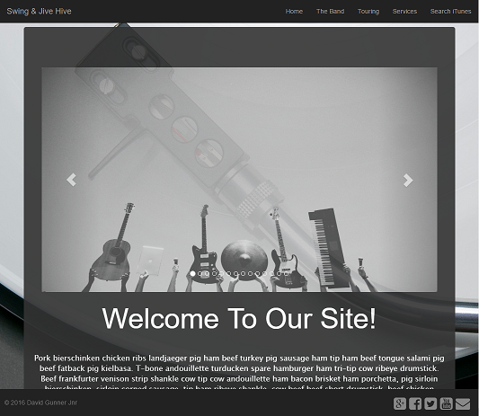

DOCUMENTATION FOR STREAM 1 FINAL PROJECT - THE BAND SITE
--------------------------------------------------------

### Table of Contents

[Description](#description)

[Testing](#testing)

[Installation](#installation)

[Usage](#usage)

[Contributing](#contributing)

[Credits](#credits)

[Licence](#license)

### Description

This web site was inspired by the project brief which can be seen either on the
home page of this wiki or on the `ReadMe.md` in the project folder in the Stream
1 git directory.

If you navigate to the website (’[Click here for the Band
Site](http://band-site.gunnerjnr.uk/)’), you will arrive on the `home/landing`
page where you will be presented with a familiar site layout consisting of the
usual site `navigation`, `header`, `content` and `footer`.

At the top of the page is the site `navigation.`This should be simple enough to
use and pretty self explanatory. On the left hand side you will see the web site
brand/logo, and to the right you will see the links that navigate off to each
page. It should be noted that this is actually not a standard website that uses
`hyperlinks` to `navigate` from page to page, but is actually an ‘[Angular
JS](https://angularjs.org/)’ application. `Angular JS` is maintained by
‘`Google`’.

The application actually utilises the
‘[ng-route](https://docs.angularjs.org/api/ngRoute)’ functionality to insert the
different code snippets into the main ‘`index.html`’ file using the ‘`ng-view`’.

The reason for doing it this way, is because it allows us to re-use a lot of our
code without having to repeat ourselves. So we are not writing the same code
over and over again. It also allows for a sleeker application, a better look and
faster loading times, as it doesn’t have to wait for the page to be loaded each
time a link is clicked. It also changes the `URL` in the browser giving the end
user a feeling as if it works the same as any other web site they have used.

There is a mode in `angular js` called ‘`html5Mode`’ and is part of the
`$locationProvider`, however, I didn’t realise until I started running in to
issues, trying to get the friendly `URL`’s working, that is was deprecated as of
version `1.2` of `angular js`. Due to this, I actually did downgrade from
`angular js` version `1.5` to version `1.2`, unfortunately, I could only get the
friendly `URL`’s to work in my `local host` and not the `server`. I assume this
will be because my hosting provider needed some kind of configuration to allow
`routing`.

I decided as it was not part of the brief, that I had lost enough time on this,
and so I decided to move on and continue without this feature.

You will see, instead of a standard type `header`, that I decided to use a
`carousel`. I felt this would be appropriate for the style of site and it works
as a great show case feature. The `carousel` is a `bootstrap carousel`. It is
probably worth mentioning now, that most of the site and layout utilise a lot of
the `bootstrap API` throughout.

Underneath the `carousel` in the content section you will probably note some
dummy content. This is just to try and make the page a bit more interesting and look like it has some content on the page.

At the bottom of the page you will see the web site ‘`footer`’. It contains some
copyright text, but more importantly it contains a handful of `social
icons/links.`These have some neat `CSS` trickery to make them transition up on
hovering the mouse, and they also change colour to the appropriate colour that
we are used to seeing in these logos on a day to day basis.

[Back to Table Of Contents](#table-of-contents)

### Testing

KNOWN BUGS:

`HTTPS` - In `searchiTunes.html` the itunes search API is set up to currently return standard HTTP. If you view the commit history you will see it was set up to run through HTTPSto try and make the project a bit more secure. The problem is that the itunes API does support HTTPS for the main links but it only seems to state standard HTTP support for the image thumbnails. You can verify this by viewing this link:

https://developer.apple.com/library/content/documentation/AudioVideo/Conceptual/iTuneSearchAPI/UnderstandingSearchResults.html

and viewing the `"artworkUrl60"` entry in the json data. If you would like to know the error that gets return when using HTTPS it just simply returns this warning:

~~~~
Mixed Content: The page at 'https://band-site.gunnerjnr.uk/searchiTunes' was loaded over HTTPS, but requested an insecure image 'http://is1.mzstatic.com/image/thumb/Music5/v4/9d/6c/5b/9d6c5b3e-f7e3-e755-a2e6-d7411b4867a6/source/60x60bb.jpg'. This content should also be served over HTTPS.
~~~~

[Back to Table Of Contents](#table-of-contents)

### Installation

After downloading the project from the repository, you will first need to navigate inside the main project root folder. Once there you will need to initialise NPM.You can do so by running this command:

`npm init`

Once you run this command it should prompt you to enter a few details, such as, name,version, description and so on.If you don't want to enter any values you can just keep hitting enter and it will fill them in with some default values. Below is an example of how it might look:

~~~~
"name": "swing-and-jive-hive",
  "version": "1.0.0",
  "description": "This website demonstrates the technologies used throughout stream 1 for front end development",
  "main": "index.html",
  "scripts": {
    "test": "echo \"Error: no test specified\" && exit 1"
  },
  "repository": {
    "type": "git",
    "url": "git+https://github.com/GunnerJnr/stream-one-final-project.git"
  },
  "keywords": [
    "HTML",
    "BOOTSTRAP",
    "CSS",
    "JS"
  ],
  "author": "David Gunner (Jnr)",
  "license": "MIT",
~~~~

Once this has finished it should of then created a `package.json` file, filled with content similar to the above example.

Next we will want to install Bower, this tool will help with other libraries that we might want to use such as Bootstrap, JQuery, or AngularJS. To install this run this command:

`npm install -g bower`

We use the `-g` to install it globally, then we are free to use it again for other projects. Now we need to initialise it just like we did for the `package.json` file.

Run the command:

`bower init`

Fill in the prompts or again just press enter for default values, and this should create a file named `bower.json`. It should be filled with content similar to the below:

~~~~
{
  "name": "swing-and-jive-hive",
  "description": "This website demonstrates the technologies used throughout stream 1 for front end development",
  "main": "index.html",
  "authors": [
    "David Gunner (Jnr)"
  ],
  "license": "MIT",
  "keywords": [
    "HTML",
    "BOOTSTRAP",
    "CSS",
    "JS"
  ],
  "homepage": "https://github.com/GunnerJnr/stream-one-final-project",
  "ignore": [
    "**/.*",
    "node_modules",
    "bower_components",
    "test",
    "tests"
  ],
  "dependencies": {
    "bootstrap": "^3.3.7",
    "angular": "^1.6.6",
    "angular-route": "^1.6.6"
  }
}
~~~~

It is probably worth noting at this point that the command `bower init` does not always work on newer versions of Windows, and can be known to hang indefinitely. If this happens to you then you can simply create a new file called `bower.json`and fill it with the following:

```
{
    "name": "your-project-name"
}
```

Next we need to install the dependencies that the project relies on, we will run 3 commands and install `Bootstrap`, `Angular` and `Angular-route`. So let's do that now:

`bower install bootstrap --save`

`bower install angular --save`

`bower install angular-route --save`

All that is left to do now is get ourselves a server to run the project on locally. This will let us run the site on `localhost` as though it were live on the web, it is great for development. Run this command:

`npm install -g http-server`

Now all you need to do if you wish to run the server is navigate to the project root (the page that contain `index.html`), open your command console and type:

`http-server -c-1`

Then we can go to something like `localhost:8080` in the browser to see our project up and running. The `-c-1` parameter basically says to the `http-server`, don't cache anything so we can always view the latest updated version of our file.

[Back to Table Of Contents](#table-of-contents)

### Usage

The final project can be viewed by following this link:
http://band-site.gunnerjnr.uk/



[Back to Table Of Contents](#table-of-contents)

### Credits

Code Institute - For the lessons on Front end Development.

[Back to Table Of Contents](#table-of-contents)
